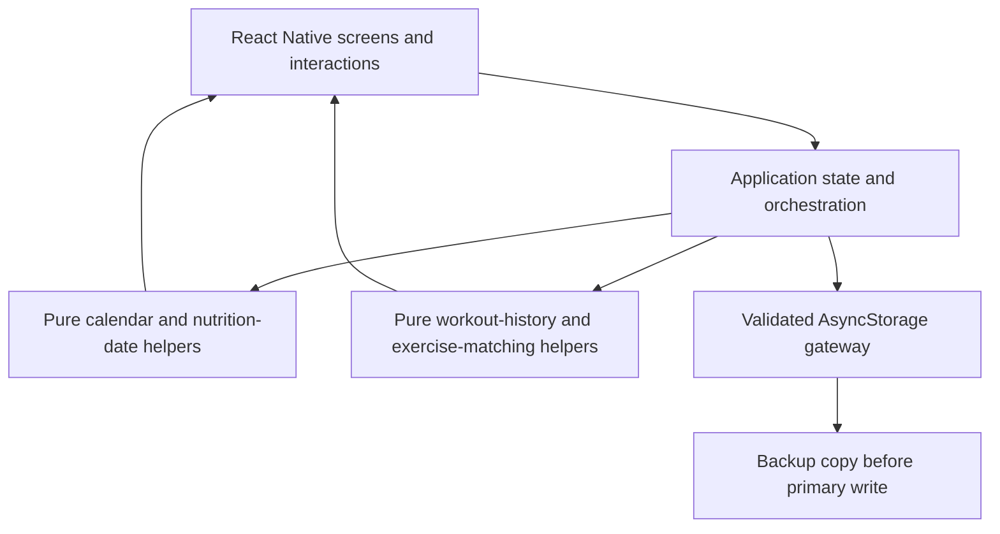

# Gym Progress Tracker

[](https://expo.dev/)
[](https://reactnative.dev/)
[](https://www.typescriptlang.org/)
[](#privacy-and-data-safety)
[](#testing-and-quality)

A local-first mobile app that brings workout logging, progressive-overload feedback,
nutrition tracking, bodyweight trends, and consistency history into one focused
training workflow.

The project started from a practical problem: gym progress was split between notes,
calorie apps, timers, and spreadsheets. Gym Progress Tracker keeps those signals
together and turns past entries into useful context for the next session.

> Built as a student portfolio project to demonstrate product thinking, React Native
> development, defensive local persistence, deterministic date handling, and an
> AI-assisted engineering workflow.

## Why It Is Useful

Most workout loggers record what happened. This app also helps answer what to do next:

- **What did I lift last time?** Each set shows the previous result for the exact
  exercise, even if that exercise was skipped in the immediately preceding week.
- **Am I progressing?** Weight and reps are compared with prior performance and marked
  as progressive, unchanged, or below the previous result.
- **Am I training consistently?** A weekly view shows gym visits, while the expanded
  month calendar preserves the full available workout history.
- **How does training connect to nutrition and weight?** Calories, macros, bodyweight,
  volume, personal records, and estimated 1RM live in the same app.
- **Can I use my own routine?** Custom workout days and their exercise structure carry
  into future weeks and remain editable.

The result is a compact daily tool rather than a collection of disconnected trackers.

## Product Highlights

### Workout intelligence

- Push, Pull, and Legs programs plus user-created workout days
- Exercise autocomplete learned from the user's saved workout history
- Exact-name historical matching to prevent incorrect comparisons between similarly
  named movements
- Previous-set reference for weight and reps
- Progressive-overload status for every comparable set
- Estimated one-rep max using the Epley formula
- Weekly volume and personal-record analysis
- Set completion, configurable rest timer, vibration feedback, and plate calculator
- Persistent XP and levels, with gym visits counted independently per calendar week

### Nutrition and bodyweight

- Fast calorie entry with add and subtract actions
- Meal logging with protein, carbohydrate, and fat totals
- Automatic macro targets for bulk or cut goals, with a custom-target option
- Daily calorie targets that carry forward safely
- Nutrition resets archived as dated sessions instead of silently discarding history
- Weekly bodyweight entries, unit conversion, averages, and goal-aware progress feedback

### Progress history

- Monday-to-Sunday consistency calendar based only on completed workout sets
- Full month-by-month history with correct day alignment and a visible marker for today
- Calories shown only in the expanded history and only on their validated session date
- Safe handling of missing, duplicate, malformed, legacy, and out-of-range stored values

## Engineering Highlights

This project deliberately treats a local mobile app as a real data system, not just a UI
demo.

| Challenge | Implementation |
| --- | --- |
| Date and timezone correctness | Strict `YYYY-MM-DD` keys, explicit validation, and UTC-based calendar arithmetic for week/month boundaries |
| Reliable exercise comparison | Normalized exact identities and same-family history lookup across base and extra workout days |
| Backward-compatible evolution | Stored records are normalized on read; missing legacy fields receive conservative defaults |
| Data-loss prevention | AsyncStorage access is centralized, writes keep a backup copy, and destructive UI actions require confirmation |
| Corrupted or excessive input | Invalid values are ignored safely and stored collections have explicit size limits |
| Testable business logic | Calendar and workout-history calculations are extracted into pure TypeScript helpers |
| Debuggability without leaking data | Storage failures use redacted structured warnings rather than logging workout or nutrition details |

## Architecture



The main screen orchestration currently lives in `App.tsx`. Higher-risk date and
history behavior is separated into `progressCalendar.ts` and `workoutHistory.ts`, where
it can be exercised without rendering the mobile UI.

## AI-Assisted Engineering

The app does not pretend that deterministic tracking features require a runtime AI
model. Instead, AI was used as an engineering collaborator during development:

- turning user-reported behavior into scoped implementation requirements
- investigating date, persistence, and backward-compatibility risks
- proposing small architectural boundaries for risky logic
- generating edge-case test ideas and reviewing failure paths
- accelerating debugging while keeping implementation decisions and verification under
  developer control

This distinction is intentional. It demonstrates practical AI literacy without adding
an unnecessary API dependency, sending private fitness data to a third party, or calling
ordinary calculations "AI."

## Privacy and Data Safety

- Workout, nutrition, weight, and settings data remain on the device in AsyncStorage.
- The app has no account requirement, analytics SDK, advertising SDK, or cloud backend.
- Existing storage keys and legacy records are preserved through defensive normalization.
- Calendar rendering rejects malformed dates and deduplicates repeated completion data.
- Nutrition history uses explicit session boundaries so reset actions keep the correct
  date context.
- Storage diagnostics contain event metadata only, not personal workout or nutrition
  content.

Because storage is device-local, deleting the app can also delete its data. Cloud sync
and export/restore are intentionally listed as future work rather than implied features.

## Testing and Quality

The focused verification suite covers the failure-prone parts of the app:

- week and month boundaries, leap dates, weekday alignment, and timezone-safe date keys
- duplicate, malformed, future, and oversized calendar inputs
- calorie-session attribution and exclusion of invalid or subtraction entries
- exact exercise comparison across weeks and workout-day families
- autocomplete ranking and deduplication
- custom-day carry-forward and deletion isolation
- storage access boundaries, explicit limits, redacted logging, and destructive-action
  guardrails
- TypeScript compilation with no emitted output

Run every check:

```bash
npm run check
```

Or run a focused suite:

```bash
npm run check:calendar
npm run check:workouts
npm run check:safety
```

The app has also been built, code-signed, installed, and tested on physical iPhone
hardware in addition to Expo development workflows.

## Tech Stack

- React Native 0.85 and React 19
- Expo 56
- TypeScript 6
- AsyncStorage for local persistence
- React Native Gesture Handler and Reanimated
- Node assertion scripts for focused regression and safety checks

## Run Locally

### Prerequisites

- Node.js and npm
- An Expo-compatible iOS, Android, or web environment
- Xcode for native iOS builds
- Android Studio for native Android builds

### Setup

```bash
git clone https://github.com/anaschatz/gym_app.git
cd gym_app
npm install
npm run check
```

Start Expo:

```bash
npm start
```

Platform commands:

```bash
npm run ios
npm run android
npm run web
```

The install step runs a small, version-checked Expo LogBox compatibility patch when the
relevant generated iOS file exists.

## Project Structure

```text
.
|-- App.tsx                         # UI, app state, workflows, persistence orchestration
|-- progressCalendar.ts            # Pure calendar, date, and calorie-history logic
|-- workoutHistory.ts              # Exact comparison, suggestions, and custom-day logic
|-- scripts/
|   |-- progressCalendar.check.mjs # Calendar and date regression checks
|   |-- workoutHistory.check.mjs   # Workout-history behavior checks
|   |-- safety.check.mjs           # Architecture and safety invariants
|   `-- patch-expo-logbox.js       # Scoped Expo iOS compatibility patch
|-- assets/icon.png                # Application icon
|-- app.json                       # Expo and native application configuration
|-- metro.config.js                # Metro configuration
`-- package.json                   # Dependencies and development commands
```

## Key Trade-offs

- **Local-first over cloud sync:** simpler onboarding and stronger privacy, but no
  cross-device recovery yet.
- **Focused assertion scripts over a large test framework:** fast checks for pure logic
  and architecture invariants, but UI automation remains a future addition.
- **Single-screen orchestration over early abstraction:** development stayed fast while
  risky logic moved into dedicated helpers; further component extraction is now the
  clearest maintainability improvement.

## Roadmap

- Encrypted export and restore for user-controlled backups
- Component and storage-module extraction from `App.tsx`
- Automated React Native interaction and accessibility tests
- Optional on-device or privacy-preserving coaching insights based on the user's own
  training trends
- Release automation for repeatable signed builds

## Portfolio Discussion Points

This repository is a useful starting point for discussing:

- how product feedback was translated into backward-compatible iterations
- why exact identity matching is safer than fuzzy matching for exercise comparisons
- how strict date keys prevent subtle calendar and timezone regressions
- how local persistence can be validated, bounded, backed up, and observed
- where AI assistance speeds up development and where deterministic logic is the better
  engineering choice

## Current Scope

This is an actively developed student project, not a medical device or a replacement for
professional training or nutrition advice. The current release is local-first and does
not include authentication, a server backend, social features, or cloud synchronization.
